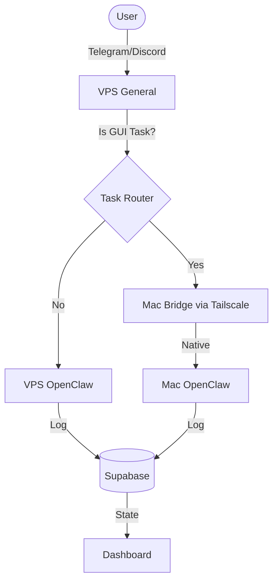

# System Architecture

## Design Principle

**BMAD extends OpenClaw — it never competes with it.**

OpenClaw handles: sessions, channels (Telegram/Discord/Slack), agent routing, skills, usage display, model management, cron, chat commands, WebChat UI, and Tailscale.

BMAD adds: organization identity, agile task lifecycle, persistent memory, $ cost tracking, budget enforcement, VPS health monitoring, and a configuration dashboard.

## Hybrid Architecture (The General & The Soldier)

We run **Twin OpenClaw Installations** kept in sync via shared memory.

1. **VPS (The General)**: 24/7 endpoint for Telegram/Discord. Classifies tasks.
2. **Mac (The Soldier)**: Local worker with GUI, Vision, and physical hands. Executes GUI tasks.
3. **Tailscale**: Secure tunnel between the twins.
4. **Supabase**: Shared brain where both twins read/write state.

## Data Flow

## Security

- All services bind `127.0.0.1`
- Access via Tailscale only
- UFW default deny inbound
- Secrets in `.env`, never committed
- Supabase RLS: anon key read-only, service role for writes
- Dashboard writes audited to `audit_log`

## Cost Control (Two-Tier)

| Tier          | Source                                                                             | Enforcement                          |
| ------------- | ---------------------------------------------------------------------------------- | ------------------------------------ |
| T1 Hard       | `.env` (MAX_DAILY_SPEND_HARD, MAX_PER_AGENT_TOKENS_HARD, MAX_PER_TASK_TOKENS_HARD) | Cannot be exceeded at runtime        |
| T2 Adjustable | Supabase `organization_settings`                                                   | Editable via dashboard, capped by T1 |

Alerts sent to Telegram owner at: warning threshold, limit reached, anomaly spike.
